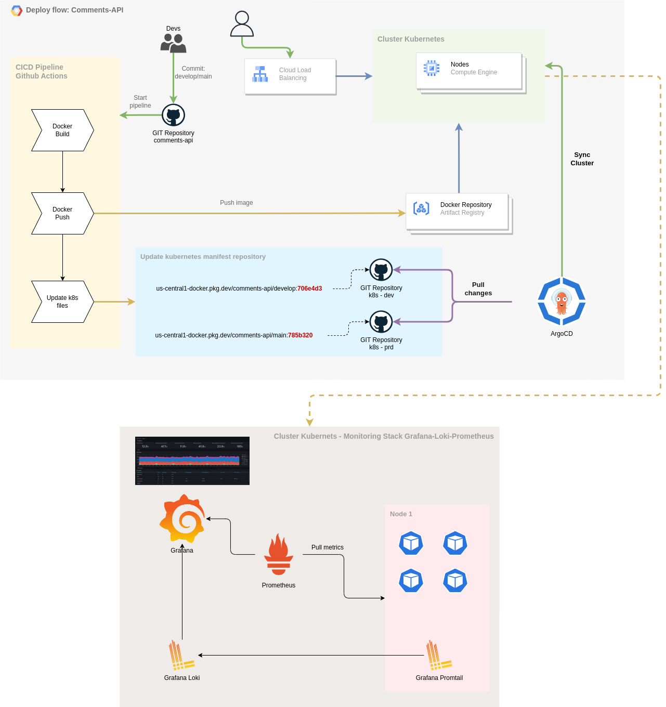

# História

A cloud escolhida para o provisonamento da infra é a Google Cloud Plataform (GCP). Atualmente tenho vivência com essa nuvem e a implementação desse desafio será mais produtivo nessa cloud.

A infra está sendo provisionada usando o terraform, o objetivo final é subir um cluster no GKE com 4 nodes, vinculada a uma VPC e subnet e a criação de um repositório de imagem Docker no Artifact Registry.

Após o provisionamento do cluster, é executado via terraform o provider do Helm, onde é instalado a stack de monitoramento do Prometheus, Grafana e Loki e o ArgoCD para a entrega contínua das aplicações no Kubernetes.

A aplicação que envolve esse desafio, de comentários, foi conteinerizada e será hospedada no Artifact Registry no GCP.

Foi criado um CI/CD usando o GitHub Actions, que para cada commit nas branches `develop` e `main` seja disparado a pipeline para a construção e o envio da imagem ao repositório docker.

Ainda durante o provisionamento do Terraform, após subir o ArgoCD, é provisionado a aplicação de api de comentários no ArgoCD, é criado uma aplicação para o ambiente de desenvolvimento e outra para produção, a divisão é feita por namespace.

Após o provisionamento, as instâncias do Grafana e ArgoCD podem ser acessadas via IP, pois as duas estão com o tipo de serviço como Load Balancer.

Foi criado dois repositórios no github para armazenar os arquivos de manifesto kubernetes `comments-api-dev` e `comments-api-prd`. A forma de deploy segue as práticas de GitOps, onde o repositório git é a única fonte de informações da infraestrutura como código.

Durante a pipeline, há um step que clona o repositório de manifesto kubernetes e atualiza a imagem do deployment com a tag do `short commit` da aplicação, faz o commit dessa alteração e envia para o repositório. O ArgoCD irá reconhecer essa alteração no repositório e deployar a aplicação no cluster.

Para a execução do Terraform, foi criado uma Service Account com permissão de Editor (pode e deveria estar com permissões mais restritas).

Foi provisionado no grafana um datasource do Loki, para que os logs da aplicação de comentários possa ser visualizado.

Podemos visualizar na imagem abaixo o resultado final do provisionamento:

### Github Actions

As seguintes secrets foram cadastradas no Github para que o CICD possa ser executado.

- GCP_PROJECT_ID: Projeto ID do GCP
- GCP_REGION: Região do GCP
- GCP_REGISTRY: Url do repositório no Artifact Registry
- GCP_SERVICE_ACCOUNT_KEY: Chave formato JSON da Service Account do GCP
- GH_ACCESS_TOKEN: Access Token do Github com permissão de "workflow"

## Repositório de manifesto Kubernetes

Os dois repositórios abaixo contém os recursos de `deployment` e `service`.

Estão separados por ambientes, sendo um para desenvolvimento e outro para produção.

1. [Comments API - DEV](https://github.com/aristidesneto/comments-api-dev)
1. [Comments API - PRD](https://github.com/aristidesneto/comments-api-prd)

Durante a execução da pipeline, esses são clonados e tem o hash da imagem atualizada com o commit atual, e após a atualização, a pipeline faz o commit e um push com as alterações.

## Complementos

Nessa seção gostaria de deixar alguns pontos que podem ser melhorados nesse implementação que desenvolvi.

1. A organização dos arquivos do Terraform, poderia ser desenvolvida como módulos, usar como backend do state um bucket como o GCS.
2. Instalação do Ingress Nginx Controller para usar como proxy das aplicações, dessa forma os serviços que deixei como LoadBalancer não ficaria expostos.
3. Talvez fazer a aplicação salvar em um banco de dados os comentários inseridos, um banco no Cloud Sql.
4. Não foi configurado disco para persistência de dados do Grafana e Prometheus.
5. A instalação da stack de monitoramento foi realizada praticamente com as configurações padrões.
6. Adição de steps de segurança no CICD, exemplo: Sonarqube, Snyk para scan de vulnerabilidades, validação de dados sensíveis nos logs da aplicação.
7. A Service Account criada para executar o terraform contém mais permissões do que deveria, sendo que é boa prática manter o princípio do menor privilégio.
8. Em ambiente real, os arquivos do terraform não deve estar no mesmo repositório de código da aplicação.
