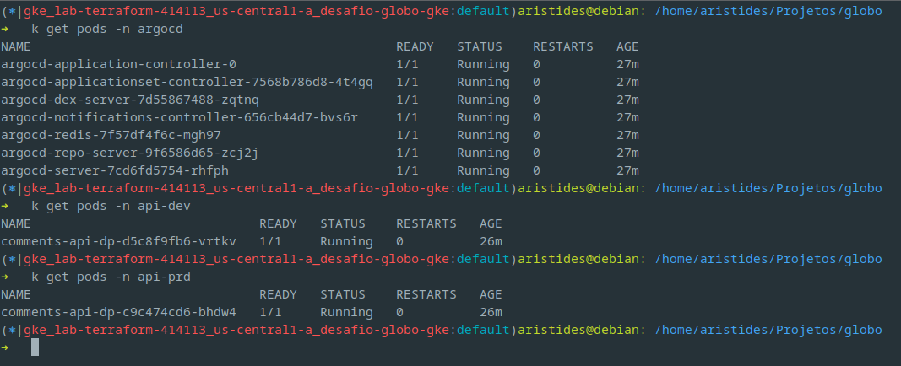

# História

A cloud escolhida para o provisonamento da infra é a Google Cloud Plataform (GCP). Atualmente tenho vivência com essa nuvem e a implementação desse desafio usando ela será mais produtivo.

A infra está sendo provisionada usando o terraform, o objetivo final é subir um cluster no GKE com 4 nodes, vinculada a uma VPC e subnet e a criação de um repositório de imagem Docker no Artifact Registry.

Após o provisionamento do cluster, é executado via terraform o provider do Helm, onde é instalado a stack de monitoramento do Prometheus, Grafana e Loki e o ArgoCD para a entrega contínua das aplicações no Kubernetes.

A aplicação que envolve esse desafio, de comentários, foi conteinerizada e será hospedada no Artifact Registry no GCP.

Foi criado um CI/CD usando o GitHub Actions, que para cada commit nas branches `develop` e `main` seja disparado a pipeline para a construção e o envio da imagem ao repositório docker.

Ainda durante o provisionamento do Terraform, após subir o ArgoCD, é provisionado a aplicação de api de comentários no ArgoCD, é criado uma aplicação para o ambiente de desenvolvimento e outra para produção, a divisão é feita por namespace.

Após o provisionamento, as instâncias do Grafana e ArgoCD podem ser acessadas via IP, pois as duas estão com o tipo de serviço como Load Balancer.

Foi criado dois repositórios no github para armazenar os arquivos de manifesto kubernetes `comments-api-dev` e `comments-api-prd`. A forma de deploy segue as práticas de GitOps, onde o repositório git é a única fonte de informações da infraestrutura como código.

Durante a pipeline, há um step que clona o repositório de manifesto kubernetes e atualiza a imagem do deployment com a tag do `short commit` da aplicação, faz o commit dessa alteração e envia para o repositório. O ArgoCD irá reconhecer essa alteração no repositório e deployar a aplicação no cluster.

Foi provisionado no grafana um datasource do Loki, para que os logs da aplicação de comentários possa ser visualizado. Também é provisionado um dashboard customizado para visualizar informações sobre requisições da aplicação.

Podemos visualizar na imagem abaixo o resultado final do provisionamento da infraestrutura:


## Informações complementares

- Criação dos recursos `terraform apply`: ~17 min
- Destruição dos recursos `terraform destroy`: ~12 min

## Github Actions

As seguintes secrets foram cadastradas no Github para que o CICD possa ser executado.

- GCP_PROJECT_ID: Projeto ID do GCP
- GCP_REGION: Região do GCP
- GCP_REGISTRY: Url do repositório no Artifact Registry
- GCP_SERVICE_ACCOUNT_KEY: Chave formato JSON da Service Account do GCP
- GH_ACCESS_TOKEN: Access Token do Github com permissão de "workflow"

Código do workflow do github actions:

```yaml
name: Deploy

on:
  workflow_dispatch:

  push:
    branches: ["main", "develop"]

env:
  APP_NAME: "comments-api"
  PROJECT_ID: "${{ secrets.GCP_PROJECT_ID }}"
  REGION: "${{ secrets.GCP_REGION }}"
  REGISTRY: "${{ secrets.GCP_REGISTRY }}"

jobs:
  build:
    runs-on: ubuntu-latest
    strategy:
      matrix:
        python-version: ["3.11"]

    steps:
      - name: Checkout
        uses: actions/checkout@v4

      - name: Extract branch name
        id: get_branch
        run: |-
          branch_name=${GITHUB_REF#refs/heads/}
          echo "##[set-output name=branch_name]${branch_name}"

      - name: Extract short commit
        id: get_short_commit
        run: |-
          short_commit=${GITHUB_SHA::7}
          echo "##[set-output name=short_commit]${short_commit}"

      - name: Set environment
        id: get_environment
        run: |-
          branch_name=$(echo ${{ steps.get_branch.outputs.branch_name }})
          if [ $branch_name == 'main' ]; then
            environment=prd
          else
            environment=dev
          fi
          echo "##[set-output name=environment]${environment}"

      - name: GCP authentication
        uses: "google-github-actions/auth@v2"
        with:
          credentials_json: "${{ secrets.GCP_SERVICE_ACCOUNT_KEY }}"

      - name: Set up Cloud SDK
        uses: "google-github-actions/setup-gcloud@v1"

      - name: Docker auth
        run: |-
          gcloud auth configure-docker ${{ env.REGISTRY }} --quiet

      - name: Docker build
        run: |-
          make build

      - name: Docker push
        run: |-
          make push

      - name: Update k8s files
        run: |-
          branch_name=$(echo ${{ steps.get_branch.outputs.branch_name }})
          short_commit=$(echo ${{ steps.get_short_commit.outputs.short_commit }})
          environment=$(echo ${{ steps.get_environment.outputs.environment }})
          app_name="${{ env.APP_NAME }}-$environment"

          git clone https://aristidesneto:${{ secrets.GH_ACCESS_TOKEN }}@github.com/aristidesneto/$app_name.git $app_name

          cd $app_name

          git config --local user.email "cicd@example.com"
          git config --local user.name "CICD"
          git config --local credential.helper 'store --file=.git/credentials'
          echo "https://github.com/aristidesneto:${{ secrets.GH_ACCESS_TOKEN }}" > .git/credentials

          sed -i "s/$branch_name:.*/$branch_name:$short_commit/g" $APP_NAME-deployment.yaml

          git diff

          git commit -am "Update image to commit $short_commit"
          git push
```

## Repositório de manifesto Kubernetes

Os dois repositórios abaixo contém os recursos de `deployment` e `service`.

Estão separados por ambientes, sendo um para desenvolvimento e outro para produção.

1. [Comments API - DEV](https://github.com/aristidesneto/comments-api-dev)
1. [Comments API - PRD](https://github.com/aristidesneto/comments-api-prd)

Durante a execução da pipeline, esses são clonados e tem o hash da imagem atualizada com o commit atual, e após a atualização, a pipeline faz o commit e um push com as alterações.

## Melhorias

Nessa seção gostaria de deixar alguns pontos que podem ser melhorados nesse implementação que desenvolvi.

1. A organização dos arquivos do Terraform, poderia ser desenvolvida como módulos, usar como backend do state um bucket como o GCS.
1. Instalação do Ingress Nginx Controller para usar como proxy das aplicações, dessa forma os serviços que deixei como LoadBalancer não ficaria expostos.
1. Talvez fazer a aplicação salvar em um banco de dados os comentários inseridos, um banco no Cloud Sql.
1. Não foi configurado disco para persistência de dados do Grafana e Prometheus.
1. A instalação da stack de monitoramento foi realizada praticamente com as configurações padrões.
1. Adição de steps de segurança no CICD, exemplo: Sonarqube, Snyk para scan de vulnerabilidades, validação de dados sensíveis nos logs da aplicação.
1. A Service Account criada para executar o terraform contém mais permissões do que deveria, sendo que é boa prática manter o princípio do menor privilégio.
1. Em ambiente real, os arquivos do terraform não deve estar no mesmo repositório de código da aplicação.
1. O provisionamento do dashboard customizado está sendo feito de forma que o YAML está chumbado no código do terraform, tentei deixar em um arquivo separado o YAML e apenas referenciar o path, mas não tive sucesso, sendo um ponto de estudo para melhoria.

## Recursos e ferramentas provisionadas

- Datasource Loki provisionado com terraform
  

- Dashboard customizado criado para visualizar requisições da aplicação
  

- Pods namespace de monitoramento como `prometheus` e `loki`
  

- Pods namespace das aplicações como `argocd`, `api-dev` e `api-prd`
  
